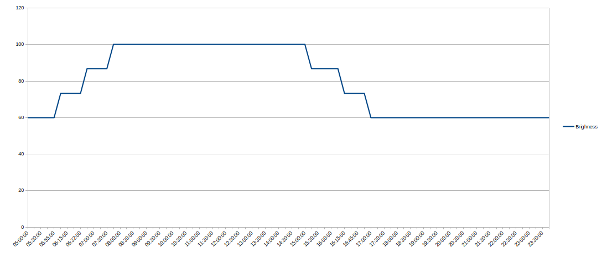

# External Monitor Brightness Adjusting Tool

This Python application is designed to run in the background and automatically adjust the brightness of external monitors connected to a Linux machine based on the time of day and seasonal changes. It utilizes the [`ddcutil`](https://www.ddcutil.com/) tool to communicate with the monitors via the Display Data Channel (DDC) protocol.

The application reads the dawn, sunrise, dusk and sunset times for a specified location and adjusts the brightness of the connected monitors gradually. From dawn to (sunrise + offset) time brightness is gradually increased from the night brightness to the day brightness. From (sunset - offset) to dusk time brightness is gradually decreased from the day brightness to the night brightness.
The offset is set to 60 minutes by default, but can be changed.

Number of steps for the brightness change is set to 4, but can be set beteween 1 and 10. One step means that brightness is changed at the time close to the dawn to a day brighness value and at the time close to dusk to a night brighness value.

To monitor and adjust brighness the application starts a cron job that runs every 15 minutes by default between 5:00 and 23:00 (5 AM and 11 PM). Job launch interval can also be changed.

> For more details about the parameters see the [Configuration](#Configuration) and [Options](#Options) sections.

The image below shows the brightness levels for the day with the dawn at 05:55:00, sunrise at 06:32:00, sunset at 16:09:00 and dusk at 16:46:00.



The astral times for a given location (in the `config.json` file) are taken fro the [astral](hhttps://astral.readthedocs.io/en/latest/) library. Therefore no internet connection is needed for this application.

This tool does not work with built-in laptop displays, because ususally their brightness is controlled by the laptop's hardware, and not by the DDC protocol.

## Key Functionality

- Automatically adjusts the brightness of connected external monitors based on the time of day and season (summer/winter).
- Supports custom brightness settings for specific monitor models and serial numbers.
- Sends desktop notifications when the brightness is adjusted.
- Runs as a background process, controlled by the `APScheduler` library.
- Prevents multiple instances of the application from running simultaneously.

## Dependencies

- Python 3.11, 3.12, or 3.13
- `ddcutil` (available in most Linux distributions):
    - `ddcutil` web-site: [https://www.ddcutil.com/](https://www.ddcutil.com/)
- Python packages:
  - `notify2`
  - `APScheduler`
  - `astral`
  - `zoneinfo`

## Installation

1. Clone the repository or download the source code.
2. Navigate to the project directory.
3. Make the installation script executable and run it.

```bash
./install.sh
```

This script will create a virtual environment, install the required Python packages, and create a symbolic link to the application executable in your `~/.local/bin` directory (or `/usr/local/bin` on macOS).

**Note:** You can optionally provide the `-p` flag to specify a custom path for the virtual environment:

```bash
./install.sh -p /path/to/venv
```

## Configuration

The application uses a configuration file located at `~/.config/external-monitor-brightness/config.json`. If the file does not exist, the application will use default settings.

The configuration file should have the following structure:

```json
{
  "city": "City Name",
  "location": "Country",
  "timezone": "Continent/City",
  "latitude": 50.7014831,
  "longitude": 7.1645746,
  "cron_interval": 15,
  "adjust_steps": 4,
  "sunrise_sunset_offset": 60,
  "monitors": {
    "Monitor Model 1": {
      "serial": "Monitor Serial Number",
      "summer": {
        "day_brightness": 100,
        "night_brightness": 60
      },
      "winter": {
        "day_brightness": 90,
        "night_brightness": 60
      }
    }
  },
  "default": {
    "summer": {
      "day_brightness": 100,
      "night_brightness": 60
    },
    "winter": {
      "day_brightness": 90,
      "night_brightness": 60
    }
  }
}
```

- `city`, `location`, `timezone`, `latitude`, and `longitude` are used to determine the sunrise and sunset times.
- `cron_interval` (optional) specifies the interval in minutes between brightness adjustments. The default value is 15 minutes. Accepted values are 10, 15, 20 and 30.
- `adjust_steps` (optional) specifies the number of steps for the brightness change. The default value is 4. Accepted values are 1 to 10.
- `sunrise_sunset_offset` (optional) specifies the offset in minutes for the sunrise and sunset times. Offset is added to the sunrise time and deducted from the sunset time. The default value is 60 minutes. Can be set between 0 and 120 minutes.
- `default` contains the default brightness settings for monitors not listed in the `monitors` section.
- `monitors` (optional) contains specific brightness settings for individual monitor models and serial numbers. If not specified, the default settings will be used.
    - The name of the monitor section is not important and can be any string which is clear for you.
    - Serial number is important, because it is used by the application to identify the monitor. It can be that you have two monitors of the same model and you want to set different brightness settings for them.
    - To list your monitors and their serial numbers, run `ddcutil detect --terse`.

## Usage

After installation, you can run the application with the following command (put it in the background):

```bash
external-monitor-brightness &
```

Or with command line options:

```bash
external-monitor-brightness --cron-interval 20 --adjust-steps 5 --sunrise-sunset-offset 75 &
```

I recommend adding this command to your startup applications to ensure the application starts automatically when you log in.
If you are using a desktop environment that supports systemd services, you can create a systemd service file to manage the application.

By default, the application will run in the background (the dedicated cron job is created) and adjust the monitor brightness every 15 minutes between 5:00 AM and 11:00 PM.

## Options

- `-i, --cron-interval`: Specify the interval in minutes between brightness adjustments. (default: 15 minutes)
    - Can be set to 10, 15, 20, or 30 minutes.
- `-s, --adjust-steps`: Specify the number of steps for the brightness change. (default: 4)
    - Can be set between 1 and 10.
- `-o, --sunrise-sunset-offset`: Specify the offset in minutes for the sunrise and sunset times. (default: 60 minutes)
    - Can be set between 0 and 120 minutes.
- `-l, --log-directory`: Specify the directory for the application logs. (default: `/tmp/external-monitor-brightness`)
- `-v, --version`: Display the application version.
- `-vv, --verbose`: Enable verbose logging. (loging level is set to DEBUG)

### Environment variables

- `EXTERNAL_MONITOR_BRIGHTNESS_CONFIG_PATH`: Specify the path to the configuration file. (default: `~/.config/external-monitor-brightness/config.json`)
- `EXTERNAL_MONITOR_BRIGHTNESS_LOG_DIR`: Specify the directory for the application logs. (default: `/tmp/external-monitor-brightness`)

## Logs

The application logs can be found in the `/tmp/external-monitor-brightness/application.log` file.

## Uninstallation

To uninstall the application, follow these steps:

1. Remove the symbolic link from `~/.local/bin`

```bash
rm ~/.local/bin/external-monitor-brightness
```

2. Remove the virtual environment directory (if you used the default path):

```bash
rm -rf ~/.local/virtualenv/external-monitor-brightness
```

3. Remove the configuration directory:

```bash
rm -rf ~/.config/external-monitor-brightness
```

## Contributing

Contributions are welcome! If you find any issues or have suggestions for improvements, please open an issue or submit a pull request.

## License

This project is licensed under the [MIT License](https://opensource.org/licenses/MIT).

Copyright (c) 2025 Alexey Gumirov
